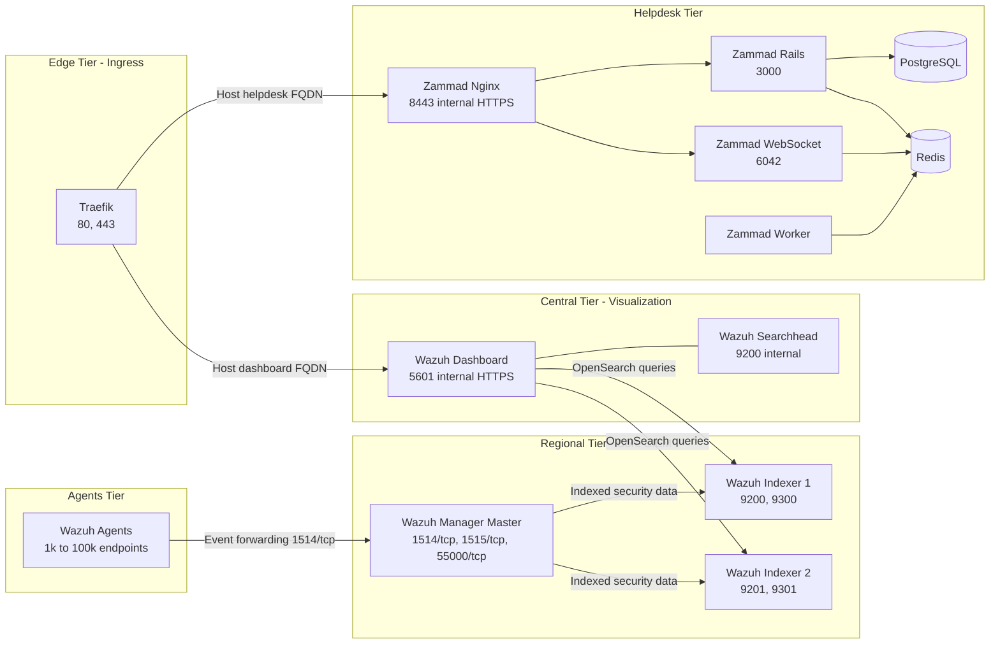
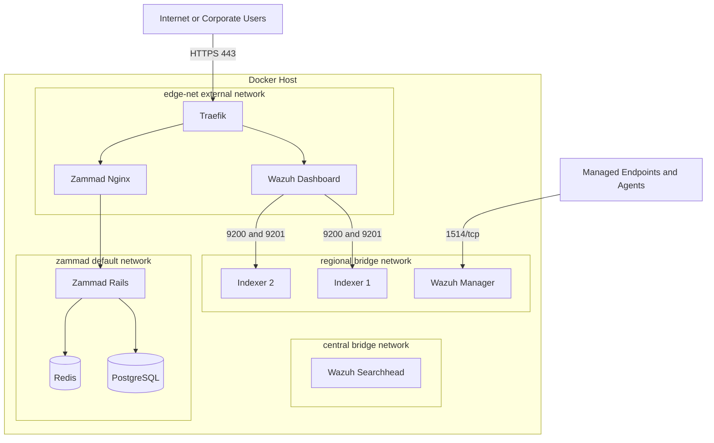
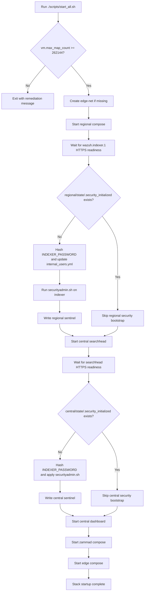
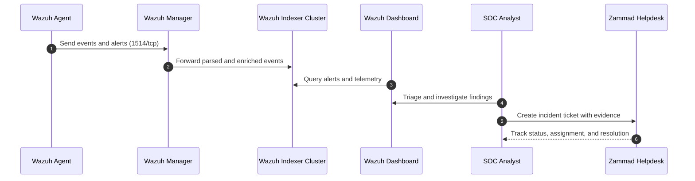
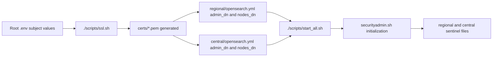

# Flow and Architecture Diagrams

This document provides detailed visual diagrams for the SOC demo stack.

## 1. System Architecture (Logical)

## 2. Network and Trust Boundaries

## 3. Full Startup and First-Run Security Flow

## 4. Security Event to Ticket Flow

## 5. Certificate and TLS Dependency Flow

## 6. Diagram Usage Notes

- Use these diagrams with `docs/2.DEPLOYMENT_GUIDE.md` for setup tasks.
- Use the startup flow when diagnosing first-run failures.
- Use event-to-ticket sequence for SOC process walkthroughs and demos.
